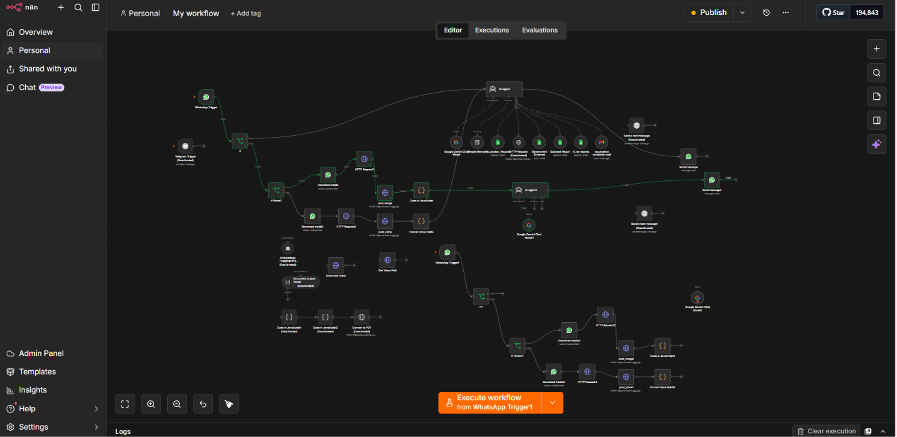

# 🏥 MEDICARE — AI-Driven Public Health Chatbot for Disease Awareness

[](https://www.youtube.com/watch?v=QaTRw4GxyUY)
[](https://n8n.io)
[](https://ai.google.dev)
[](https://www.youtube.com/watch?v=QaTRw4GxyUY)

---

## 📽️ Demo

**[▶ Watch the full demo on YouTube](https://www.youtube.com/watch?v=QaTRw4GxyUY)**

---

## 🚨 The Problem

Rural India faces a compounding healthcare crisis across access, prevention, detection and digital literacy.

| Metric | Reality |
|--------|---------|
| 👶 Child Mortality | **38,000 / yr** from vaccine-preventable diseases |
| 🏥 Doctor-Patient Ratio | **1 : 11,082** vs WHO norm of 1:1,000 |
| 💉 Vaccination Crisis | **67%** of rural children miss critical vaccinations |
| 🍽️ Malnutrition | **35.7%** of children suffer from stunting nationwide |
| ⏱️ Outbreak Detection | **21+ days** to detect a disease outbreak |
| 📱 Digital Divide | **< 15%** of rural population reached by existing health apps |

---

## 💡 The Solution

MEDICARE is a **WhatsApp-first AI health assistant** built entirely as an **n8n workflow** — no app install needed, works on any phone, and is accessible via SMS and Voice IVR too.

The entire system lives in **a single n8n workflow JSON file**. Import it, fill in your credentials, and it's live.

---

## ✨ What It Does

### 💉 Smart Vaccination Reminders

<p align="center">
  
</p>

Age-based schedule auto-generated from the Government RCH Portal. Reminders sent via WhatsApp/SMS in the user's local language, with automatic appointment booking at the nearest PHC.

### 🩻 AI X-Ray Analysis

<p align="center">
  
</p>

User sends a chest X-ray photo over WhatsApp → Gemini AI analyses it in ~30 seconds → diagnosis and nearest specialist referral sent back.

### 🥗 Malnutrition Detection

<p align="center">
  
</p>

ASHA workers enter a child's age, weight, and height → SAM/MAM risk instantly flagged using WHO z-score standards → protocol PDF + alert dispatched to the Anganwadi worker.

### 🦠 Outbreak Prediction & Surveillance

<p align="center">
  
</p>

Community-reported symptoms aggregated in real-time. Government IDSP alert triggered when **> 10 similar cases** are reported within 2 km. Detection time drops from **21 days → under 48 hours**.

### 🎙️ Voice Interface — 12+ Indian Languages

<p align="center">
  
</p>

Full IVR + Google Speech-to-Text for zero-literacy users. Supports Hindi, Tamil, Telugu, Bengali, Kannada, Marathi + dialects. Designed to reach **287 million** non-literate users.

### 🏛️ Government Scheme Finder

<p align="center">
  
</p>

Connects to **15+ databases** and **500+ central/state schemes**. Filters by income, caste, state, and age. Includes Ayushman Bharat lookup + Jan Aushadhi pharmacy locator.

---

## 🔁 How the n8n Workflow Works



```
User sends a message on WhatsApp / SMS / Voice
              │
              ▼
    ┌─────────────────────┐
    │  n8n Webhook Trigger │  ← entry point for all channels
    └──────────┬──────────┘
               │
               ▼
    ┌─────────────────────┐
    │  Language Detection  │  ← detects Hindi, Tamil, Telugu, etc.
    └──────────┬──────────┘
               │
               ▼
    ┌─────────────────────┐
    │  Intent Router       │  ← Google Gemini classifies what the user wants
    └──────────┬──────────┘
               │
    ┌──────────┼──────────────────────────────┐
    ▼          ▼           ▼          ▼        ▼
 Disease   Nutrition   X-Ray AI  Vaccination  Scheme
  Info      Check      Analysis  Scheduling   Finder
    │          │           │          │          │
    └──────────┴───────────┴──────────┴──────────┘
               │
               ▼
    ┌─────────────────────┐
    │  Format & Respond    │  ← sends reply via WhatsApp / SMS / Voice
    └─────────────────────┘
```

Every box above is a set of connected nodes inside the single workflow file. No custom server code required — n8n handles all the orchestration visually.

---

## 🚀 Getting Started

### Prerequisites

- An [n8n](https://n8n.io) account (cloud) **or** n8n installed locally/on a server
- A [WhatsApp Business API](https://developers.facebook.com/docs/whatsapp/) account
- A [Google Gemini API](https://ai.google.dev) key
- Credentials for whichever government APIs you want to enable (RCH, IDSP, Ayushman Bharat)

---

### Step 1 — Import the Workflow

1. Open your n8n instance
2. Click **"Import"** (top-right menu or `Ctrl+I`)
3. Select the file `MEDICARE_workflow.json` from this repository
4. The full workflow will load with all nodes connected

---

### Step 2 — Fill in Your Credentials

Inside n8n, open the **Credentials** panel and add the following:

| Credential | Where to get it |
|------------|-----------------|
| WhatsApp Business API key | [Meta for Developers](https://developers.facebook.com/docs/whatsapp/) |
| Google Gemini API key | [Google AI Studio](https://aistudio.google.com/app/apikey) |
| Google Speech-to-Text | [Google Cloud Console](https://console.cloud.google.com/) |
| RCH Portal API | [NHM India](https://nhm.gov.in/) |
| IDSP API | [IDSP Dashboard](https://idsp.mohfw.gov.in/) |
| Ayushman Bharat API | [NHA Developer Portal](https://nha.gov.in/) |

Each node in the workflow has a **credential field** — just select the credential you created and it will connect automatically.

---

### Step 3 — Configure Your WhatsApp Webhook

1. In n8n, find the **WhatsApp Trigger** node and copy its webhook URL
2. Paste that URL into your WhatsApp Business API webhook settings in Meta Developer Console
3. Set the verify token to match what's in the trigger node

---

### Step 4 — Activate & Test

1. Click **"Activate Workflow"** in n8n (toggle top-right)
2. Send a message to your WhatsApp Business number — e.g. `"Hi"` to see the welcome menu
3. Try sending a child's weight/height, or upload a chest X-ray image

That's it. The bot is live.

---

## 🗂️ Repository Contents

```
medicare/
├── MEDICARE_workflow.json        ← the entire system, import this into n8n
├── n8n_workflow.png              ← workflow visualization screenshot
├── Vaccination.gif               ← vaccination scheduling simulation
├── X_RAY.gif                     ← chest x-ray analysis simulation
├── SAM_MAM.gif                   ← malnutrition growth screening simulation
├── outbreak.gif                  ← outbreak prediction & surveillance simulation
├── multilingual.gif              ← regional language support (Odia) simulation
├── govtschemes.gif               ← eligible government schemes finder simulation
├── images/                       ← folder containing original screenshots
│   ├── ai_xray_analysis.png
│   ├── malnutrition_screening.png
│   ├── medicare_business_profile.png
│   ├── multilingual_support_odia.png
│   ├── scheme_finder_eligibility.png
│   ├── vaccination_scheduling.png
│   └── whatsapp_welcome_chat.png
└── README.md
```

---

## 📱 Example Conversations

**Vaccination Scheduling**
```
User → Hi
Bot  → Welcome to HealthMitra! I can help with:
       💉 Vaccination scheduling
       🩻 X-ray analysis
       🥗 Child nutrition check
       🏛️ Government scheme eligibility

User → Vaccination
Bot  → Please share your child's date of birth (DD/MM/YYYY)

User → 15/01/2024
Bot  → ✅ Schedule confirmed for Devanshu Jain
       Next due: 01/10/2024 — Measles-1, IPV-1
       Reminder set via WhatsApp
```

**AI X-Ray Analysis**
```
User → [uploads chest X-ray image]
Bot  → 🔬 Health Report — Chest X-Ray Analysis
       Condition Detected: Cardiomegaly (Enlarged Heart)
       Severity Score: 80.3 / High

       ⚠️ Recommendations:
       • Consult a cardiologist immediately
       • Avoid heavy physical activity
       • Follow a heart-healthy diet
```

**Government Scheme Finder**
```
User → I am pregnant, first pregnancy, 4-6 months, no BPL card
Bot  → ✅ YOU ARE ELIGIBLE FOR:

       PRADHAN MANTRI MATRU VANDANA YOJANA
       Total benefit: ₹5,000
       → ₹1,000 on early registration
       → ₹2,000 after 6 months pregnancy
       → ₹2,000 after child birth + immunisation

       JANANI SHISHU SURAKSHA KARYAKRAM
       Free delivery · Free transport · Free newborn care
```

---

## 📈 Projected Impact

| Metric | Target |
|--------|--------|
| 🫀 Lives Saved Annually | **25,000** via early AI detection |
| 💰 Healthcare Cost Saved | **Rs. 2,000 Cr** nationally over 5 years |
| 👥 New Users Gaining Access | **50 Million+** |
| 📚 Health Literacy Increase | **60%** improvement projected |
| 💉 Vaccination Miss Rate | **67% → 27%** |
| ⏱️ Outbreak Detection Time | **21 days → < 48 hours** |

---


---

<p align="center">Built with ❤️ for Rural India · Bharatiya Antariksh Hackathon 2026</p>
